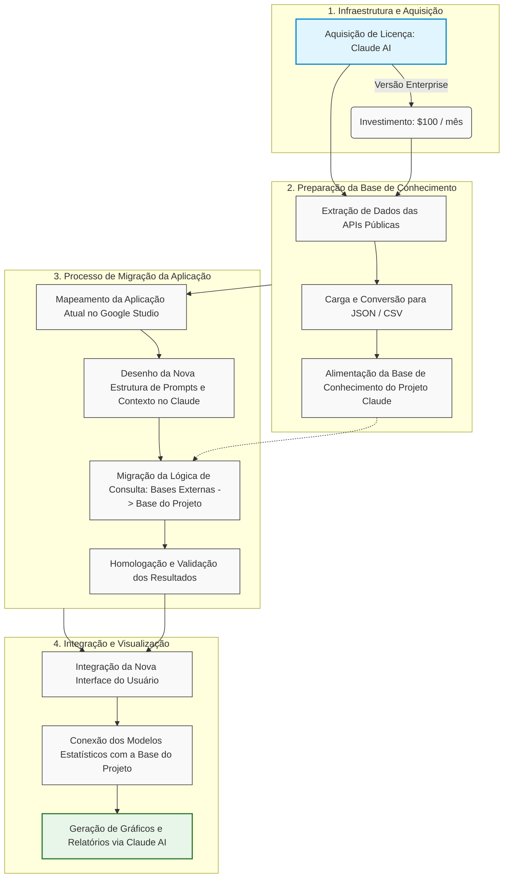

```mermaid
graph TD
    %% Estilos de nós principais
    classDef default fill:#f9f9f9,stroke:#333,stroke-width:1px;
    classDef destaque fill:#e1f5fe,stroke:#0288d1,stroke-width:2px;
    classDef fin fill:#e8f5e9,stroke:#2e7d32,stroke-width:2px;

    %% ETAPA 1: Aquisição
    subgraph Fase1 [1. Infraestrutura e Aquisição]
        A[Aquisição de Licença: Claude AI] -->|Versão Enterprise| B(Investimento: $100 / mês)
    end
    class A destaque;

    %% ETAPA 2 e 3: Dados
    subgraph Fase2 [2. Preparação da Base de Conhecimento]
        C[Extração de Dados das APIs Públicas] --> D[Carga e Conversão para JSON / CSV]
        D --> E[Alimentação da Base de Conhecimento do Projeto Claude]
    end

    %% ETAPA 4: Migração
    subgraph Fase3 [3. Processo de Migração da Aplicação]
        F[Mapeamento da Aplicação Atual no Google Studio] --> G[Desenho da Nova Estrutura de Prompts e Contexto no Claude]
        G --> H[Migração da Lógica de Consulta: Bases Externas -> Base do Projeto]
        E -.-> H
        H --> I[Homologação e Validação dos Resultados]
    end

    %% ETAPA 5: Integração
    subgraph Fase4 [4. Integração e Visualização]
        I --> J[Integração da Nova Interface do Usuário]
        J --> K[Conexão dos Modelos Estatísticos com a Base do Projeto]
        K --> L[Geração de Gráficos e Relatórios via Claude AI]
    end

    %% Conectores entre as fases principais
    A --> C
    B --> C
    Fase2 --> F
    Fase3 --> J

    class L fin;
```
